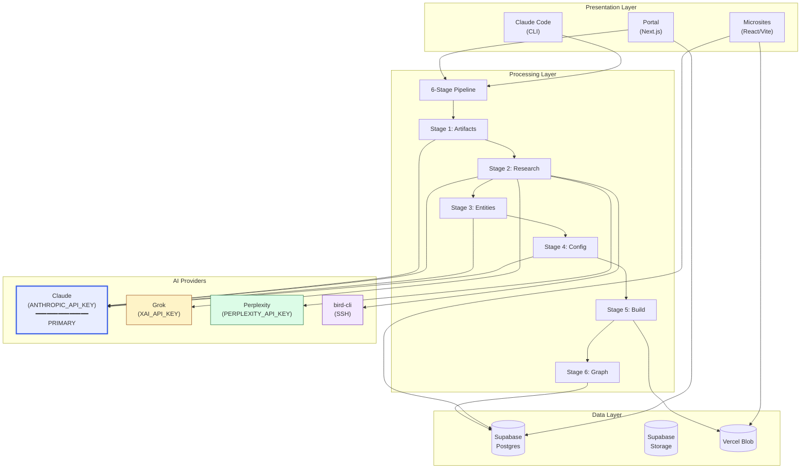

# Ritual Research Graph — Master Map

**Type:** Canonical Visual Documentation
**Version:** 1.1.0
**Created:** 2026-01-16
**Last Updated:** 2026-01-16

> **Purpose:** This document provides the canonical visual representation of all system components, data flows, and processes. Child maps provide detailed views of specific subsystems.

---

## Quick Reference

| Map | Purpose | Link |
|-----|---------|------|
| **MASTER_MAP** | System overview, component relationships | This document |
| **MAP_PIPELINE** | 6-stage processing, AI provider chain | [maps/MAP_PIPELINE.md](./maps/MAP_PIPELINE.md) |
| **MAP_DATA** | Database schema, entity relationships | [maps/MAP_DATA.md](./maps/MAP_DATA.md) |
| **MAP_AUTH** | OAuth flow, RLS policies, roles | [maps/MAP_AUTH.md](./maps/MAP_AUTH.md) |
| **MAP_INFRASTRUCTURE** | Deployment, environments, CI/CD | [maps/MAP_INFRASTRUCTURE.md](./maps/MAP_INFRASTRUCTURE.md) |
| **MAP_OPPORTUNITY** | Kanban pipeline, stages, AI actions | [maps/MAP_OPPORTUNITY.md](./maps/MAP_OPPORTUNITY.md) (Phase 2.5) |

---

## 1. System Topology (High-Level)

```
╔═══════════════════════════════════════════════════════════════════════════════╗
║                         RITUAL RESEARCH GRAPH                                  ║
║                    Transcript → Intelligence → Knowledge Graph                 ║
╠═══════════════════════════════════════════════════════════════════════════════╣
║                                                                                ║
║  ┌─────────────────────────────────────────────────────────────────────────┐  ║
║  │                           PRESENTATION LAYER                             │  ║
║  │                                                                          │  ║
║  │   ┌─────────────┐  ┌─────────────┐  ┌─────────────┐  ┌───────────────┐  │  ║
║  │   │   Portal    │  │  Pipeline   │  │   Claude    │  │  Microsites   │  │  ║
║  │   │  (Next.js)  │  │  (Kanban)   │  │    Code     │  │(React/Vite)   │  │  ║
║  │   │             │  │             │  │   (CLI)     │  │               │  │  ║
║  │   │  • Upload   │  │  • Track    │  │             │  │• Key Findings │  │  ║
║  │   │  • Monitor  │  │  • Stage    │  │  • /dev     │  │• Recommend.   │  │  ║
║  │   │  • Browse   │  │  • Assign   │  │  • /op      │  │• Entity Hover │  │  ║
║  │   │  • Edit     │  │  • AI Acts  │  │             │  │• Backlinks    │  │  ║
║  │   └──────┬──────┘  └──────┬──────┘  └──────┬──────┘  └───────┬───────┘  │  ║
║  │          │                │                │                 │           │  ║
║  └──────────┼────────────────┼────────────────┼─────────────────┼───────────┘  ║
║             │                  │                       │                      ║
║             ▼                  ▼                       ▼                      ║
║  ┌─────────────────────────────────────────────────────────────────────────┐  ║
║  │                          PROCESSING LAYER                                │  ║
║  │                                                                          │  ║
║  │   ┌──────────────────────────────────────────────────────────────────┐  │  ║
║  │   │                    6-STAGE PIPELINE                               │  │  ║
║  │   │                                                                   │  │  ║
║  │   │  Transcript ─► Artifacts ─► Research ─► Entities ─► Config ─►   │  │  ║
║  │   │                                                    Build ─► Graph│  │  ║
║  │   └──────────────────────────────────────────────────────────────────┘  │  ║
║  │                                                                          │  ║
║  └──────────────────────────────────────────────────────────────────────────┘  ║
║             │                                                                  ║
║             ▼                                                                  ║
║  ┌─────────────────────────────────────────────────────────────────────────┐  ║
║  │                         INTELLIGENCE LAYER                               │  ║
║  │                                                                          │  ║
║  │   ┌────────────┐  ┌────────────┐  ┌────────────┐  ┌────────────┐       │  ║
║  │   │   Claude   │  │    Grok    │  │ Perplexity │  │  bird-cli  │       │  ║
║  │   │ (Primary)  │  │   (xAI)    │  │   (Sonar)  │  │ (Twitter)  │       │  ║
║  │   │            │  │            │  │            │  │            │       │  ║
║  │   │ • Artifacts│  │ • Realtime │  │ • Deep     │  │ • Threads  │       │  ║
║  │   │ • Extract  │  │ • Sentiment│  │   Research │  │ • Metrics  │       │  ║
║  │   │ • Synth    │  │ • News     │  │ • Citations│  │ • Accounts │       │  ║
║  │   └────────────┘  └────────────┘  └────────────┘  └────────────┘       │  ║
║  │                                                                          │  ║
║  └──────────────────────────────────────────────────────────────────────────┘  ║
║             │                                                                  ║
║             ▼                                                                  ║
║  ┌─────────────────────────────────────────────────────────────────────────┐  ║
║  │                            DATA LAYER                                    │  ║
║  │                                                                          │  ║
║  │   ┌─────────────────────────────┐    ┌─────────────────────────────┐   │  ║
║  │   │         Supabase            │    │      Vercel Blob            │   │  ║
║  │   │                             │    │                             │   │  ║
║  │   │  • users                    │    │  • /transcripts/            │   │  ║
║  │   │  • generation_jobs          │    │  • /artifacts/              │   │  ║
║  │   │  • artifacts                │    │  • /microsites/             │   │  ║
║  │   │  • microsites               │    │                             │   │  ║
║  │   │  • entities                 │    └─────────────────────────────┘   │  ║
║  │   │  • entity_appearances       │                                      │  ║
║  │   │  • entity_relations         │    ┌─────────────────────────────┐   │  ║
║  │   │  • opportunities (expanded) │    │    Supabase Storage         │   │  ║
║  │   │  • opportunity_owners       │    │                             │   │  ║
║  │   │  • opportunity_entities     │    │  • transcripts (private)    │   │  ║
║  │   │  • pipeline_workflows       │    │  • artifacts (private)      │   │  ║
║  │   │  • pipeline_stages          │    │  • microsites (public)      │   │  ║
║  │   │  • opportunity_activity     │    └─────────────────────────────┘   │  ║
║  │   │                             │                                      │  ║
║  │   │  + Google OAuth             │                                      │  ║
║  │   │  + RLS Policies             │                                      │  ║
║  │   └─────────────────────────────┘                                      │  ║
║  │                                                                          │  ║
║  └──────────────────────────────────────────────────────────────────────────┘  ║
║                                                                                ║
╚═══════════════════════════════════════════════════════════════════════════════╝
```

---

## 2. Component Relationship Diagram



---

## 3. Data Flow Overview

```
┌─────────────────────────────────────────────────────────────────────────────┐
│                              DATA FLOW                                       │
├─────────────────────────────────────────────────────────────────────────────┤
│                                                                              │
│  USER INPUT                                                                  │
│  ══════════                                                                  │
│                                                                              │
│  [Transcript.md] ─────────────────────────────────────────────────────┐     │
│         │                                                              │     │
│         ▼                                                              │     │
│  ┌──────────────┐                                                      │     │
│  │   Storage    │◄─────────────────────────────────────────────────────┘     │
│  │ (Supabase)   │     uploads/transcripts/{user_id}/{job_id}.md             │
│  └──────┬───────┘                                                            │
│         │                                                                    │
│         ▼                                                                    │
│  STAGE 1: ARTIFACT GENERATION (Claude)                                      │
│  ═══════════════════════════════════════                                    │
│         │                                                                    │
│         ├──► Cleaned Transcript ────────► artifacts/{job_id}/transcript.md  │
│         ├──► Intelligence Brief ────────► artifacts/{job_id}/brief.md       │
│         └──► Strategic Questions ───────► artifacts/{job_id}/questions.md   │
│                                                                              │
│         │                                                                    │
│         ▼                                                                    │
│  STAGE 2: MULTI-AI RESEARCH                                                 │
│  ═══════════════════════════                                                │
│         │                                                                    │
│         ├──► [Grok] ──────────► Real-time context                           │
│         ├──► [Perplexity] ────► Deep research + citations                   │
│         ├──► [bird-cli] ──────► Twitter threads                             │
│         └──► [Claude] ────────► Narrative Research.md                       │
│                                                                              │
│         │                                                                    │
│         ▼                                                                    │
│  STAGE 3: ENTITY EXTRACTION (Claude)                                        │
│  ═══════════════════════════════════                                        │
│         │                                                                    │
│         └──► Entities JSON ─────────────► Supabase: entities table          │
│                                           (deduplicated, merged)            │
│         │                                                                    │
│         ▼                                                                    │
│  STAGE 4: SITE_CONFIG (Claude)                                              │
│  ═════════════════════════════                                              │
│         │                                                                    │
│         └──► SITE_CONFIG.js ────────────► Supabase: microsites.config       │
│                                                                              │
│         │                                                                    │
│         ▼                                                                    │
│  STAGE 5: BUILD (Vite)                                                      │
│  ═════════════════════                                                      │
│         │                                                                    │
│         └──► Static Site ───────────────► Vercel Blob: /microsites/{slug}/  │
│                                                                              │
│         │                                                                    │
│         ▼                                                                    │
│  STAGE 6: GRAPH INTEGRATION                                                 │
│  ═════════════════════════                                                  │
│         │                                                                    │
│         ├──► Supabase: microsites (register)                                │
│         ├──► Supabase: entity_appearances (link entities to microsite)      │
│         └──► Supabase: entity_relations (calculate co-occurrences)          │
│                                                                              │
│                                                                              │
│  OUTPUT                                                                      │
│  ══════                                                                      │
│                                                                              │
│  ┌─────────────────────────────────────────────────────────────────────┐    │
│  │  DEPLOYED MICROSITE                                                  │    │
│  │  research.ritual.net/sites/{slug}                                    │    │
│  │                                                                      │    │
│  │  • Bi-directional entity linking                                    │    │
│  │  • Related research via shared entities                             │    │
│  │  • Co-occurrence graph updated                                      │    │
│  └─────────────────────────────────────────────────────────────────────┘    │
│                                                                              │
└─────────────────────────────────────────────────────────────────────────────┘
```

---

## 4. AI Provider Configuration

```
╔═══════════════════════════════════════════════════════════════════════════════╗
║                         AI PROVIDER HIERARCHY                                  ║
╠═══════════════════════════════════════════════════════════════════════════════╣
║                                                                                ║
║  ████████████████████████████████████████████████████████████████████████████ ║
║  █                                                                          █ ║
║  █  PRIMARY: Claude (Anthropic)                                             █ ║
║  █  ═══════════════════════════                                             █ ║
║  █                                                                          █ ║
║  █  Environment: ANTHROPIC_API_KEY                                          █ ║
║  █  Model: claude-sonnet-4-20250514 (or opus-4-5 for complex tasks)         █ ║
║  █                                                                          █ ║
║  █  Responsibilities:                                                       █ ║
║  █  ┌────────────────────────────────────────────────────────────────────┐ █ ║
║  █  │ • Stage 1: Artifact generation (3 prompts)                         │ █ ║
║  █  │ • Stage 2: Research synthesis (final step)                         │ █ ║
║  █  │ • Stage 3: Entity extraction                                       │ █ ║
║  █  │ • Stage 4: SITE_CONFIG generation                                  │ █ ║
║  █  │ • Spot treatment editing                                           │ █ ║
║  █  └────────────────────────────────────────────────────────────────────┘ █ ║
║  █                                                                          █ ║
║  ████████████████████████████████████████████████████████████████████████████ ║
║                                                                                ║
║                                                                                ║
║  ┌────────────────────────────────────────────────────────────────────────┐  ║
║  │                                                                         │  ║
║  │  SECONDARY: Enrichment Providers                                        │  ║
║  │  ═══════════════════════════════                                        │  ║
║  │                                                                         │  ║
║  │  ┌─────────────────────┐  ┌─────────────────────┐  ┌─────────────────┐ │  ║
║  │  │ Grok (xAI)          │  │ Perplexity (Sonar)  │  │ bird-cli        │ │  ║
║  │  │                     │  │                     │  │                 │ │  ║
║  │  │ XAI_API_KEY         │  │ PERPLEXITY_API_KEY  │  │ SSH to GCP VM   │ │  ║
║  │  │                     │  │                     │  │                 │ │  ║
║  │  │ • Real-time context │  │ • Deep research     │  │ • Twitter data  │ │  ║
║  │  │ • Twitter sentiment │  │ • Web citations     │  │ • Thread trees  │ │  ║
║  │  │ • Current events    │  │ • Verified facts    │  │ • Engagement    │ │  ║
║  │  │                     │  │                     │  │                 │ │  ║
║  │  │ Stage 2 Step 1      │  │ Stage 2 Step 2      │  │ Stage 2 Step 3  │ │  ║
║  │  └─────────────────────┘  └─────────────────────┘  └─────────────────┘ │  ║
║  │                                                                         │  ║
║  └────────────────────────────────────────────────────────────────────────┘  ║
║                                                                                ║
╚═══════════════════════════════════════════════════════════════════════════════╝

Environment Variables (.env):
─────────────────────────────
ANTHROPIC_API_KEY=sk-ant-...     # PRIMARY - Claude (required)
XAI_API_KEY=xai-...              # SECONDARY - Grok real-time enrichment
PERPLEXITY_API_KEY=pplx-...      # SECONDARY - Deep research with citations
SUPABASE_URL=https://...         # Database
SUPABASE_SERVICE_KEY=eyJ...      # Service role (CLI bypasses RLS)
SUPABASE_ANON_KEY=eyJ...         # Client key (respects RLS)
```

---

## 5. Phase Implementation Status

```
┌─────────────────────────────────────────────────────────────────────────────┐
│                         IMPLEMENTATION PHASES                                │
├─────────────────────────────────────────────────────────────────────────────┤
│                                                                              │
│  Phase 0: Foundation                                                         │
│  ═══════════════════                                                         │
│  [████████████████████████████████████████] 100% COMPLETE                   │
│                                                                              │
│  • Types, specs, data layer                                                 │
│  • Example microsite imported                                               │
│  • Session continuity system                                                │
│                                                                              │
│  ───────────────────────────────────────────────────────────────────────────│
│                                                                              │
│  Phase 1a: Database & Storage                                               │
│  ═══════════════════════════                                                │
│  [████████████████████████████████████████] 100% COMPLETE                   │
│                                                                              │
│  ✓ Supabase project created                                                 │
│  ✓ All 9 tables deployed                                                    │
│  ✓ Google OAuth enabled                                                     │
│  ✓ Storage buckets created                                                  │
│  ✓ RLS policies configured                                                  │
│  ✓ TypeScript types generated                                               │
│                                                                              │
│  ───────────────────────────────────────────────────────────────────────────│
│                                                                              │
│  Phase 1b: Processing Pipeline                                              │
│  ═════════════════════════════                                              │
│  [████████████████████████████████████████] 100% COMPLETE                   │
│                                                                              │
│  ✓ CLI skeleton (scripts/generate.ts)                                       │
│  ✓ AI provider clients (Claude, Grok, Perplexity, bird)                     │
│  ✓ Prompt templates                                                         │
│  ✓ 6-stage pipeline implementation                                          │
│                                                                              │
│  ───────────────────────────────────────────────────────────────────────────│
│                                                                              │
│  Phase 2: Portal MVP           [████████░░] 80% IN PROGRESS                 │
│  ═══════════════════                                                        │
│                                                                              │
│  ✓ Next.js project setup (apps/portal)                                      │
│  ✓ Making Software design system                                            │
│  ✓ Authentication (Google OAuth)                                            │
│  ✓ Route structure                                                          │
│  ○ Generation wizard                                                        │
│  ○ Microsite list/detail views                                              │
│                                                                              │
│  ───────────────────────────────────────────────────────────────────────────│
│                                                                              │
│  Phase 2.5a: Pipeline Core     ░░░░░░░░░░ PENDING (depends on 2)            │
│  ═══════════════════════════                                                │
│                                                                              │
│  ○ Database migrations (pipeline_workflows, pipeline_stages)                │
│  ○ /pipeline Kanban UI                                                      │
│  ○ Opportunity CRUD + stage progression                                     │
│  ○ Supabase Realtime subscriptions                                          │
│                                                                              │
│  ───────────────────────────────────────────────────────────────────────────│
│                                                                              │
│  Phase 2.5b: Pipeline Advanced ░░░░░░░░░░ PENDING (depends on 2.5a)         │
│  ═══════════════════════════════                                            │
│                                                                              │
│  ○ AI strategy + email generation                                           │
│  ○ Entity linking UI                                                        │
│  ○ Chat interface (query opportunities)                                     │
│  ○ Opportunity extraction in Stage 3                                        │
│                                                                              │
│  ───────────────────────────────────────────────────────────────────────────│
│                                                                              │
│  Phase 3: Graph UI             ░░░░░░░░░░ PENDING (depends on 2.5)          │
│  Phase 4: Spot Treatment       ░░░░░░░░░░ PENDING (depends on 3)            │
│                                                                              │
└─────────────────────────────────────────────────────────────────────────────┘
```

---

## 6. Child Map Index

### [MAP_PIPELINE.md](./maps/MAP_PIPELINE.md)
Detailed 6-stage pipeline visualization including:
- Stage-by-stage flow diagrams
- AI provider sequence diagram
- Artifact lifecycle
- Error handling flows

### [MAP_DATA.md](./maps/MAP_DATA.md)
Database and storage architecture including:
- Entity Relationship Diagram (ERD)
- Table relationships
- Storage bucket structure
- Data lifecycle states

### [MAP_AUTH.md](./maps/MAP_AUTH.md)
Authentication and authorization including:
- Google OAuth flow sequence
- RLS policy matrix
- Role permission hierarchy
- Service key vs anon key usage

### [MAP_INFRASTRUCTURE.md](./maps/MAP_INFRASTRUCTURE.md)
Deployment and infrastructure including:
- Environment topology
- Service connections
- CI/CD pipeline
- Monitoring points

### [MAP_OPPORTUNITY.md](./maps/MAP_OPPORTUNITY.md) *(Phase 2.5)*
Opportunity pipeline visualization including:
- Kanban board layout
- Stage progression flow
- AI action triggers
- Entity/microsite linking
- Realtime collaboration pattern

---

## 7. Key Symbols Legend

```
ASCII Diagram Symbols:
──────────────────────
║ ═    Double lines: System boundaries
│ ─    Single lines: Connections/flows
►      Direction arrows
┌ ┐    Box corners
└ ┘    Box corners
┼      Connection point
◄      Reverse direction
█      Progress bar filled
░      Progress bar empty

Mermaid Styling:
────────────────
fill:#E8EDFF    Primary (Claude)
fill:#FEF3C7    Secondary (Grok)
fill:#DCFCE7    Secondary (Perplexity)
fill:#F3E8FF    Secondary (bird-cli)
stroke-width:3  Emphasized component

Status Indicators:
──────────────────
✓      Complete
⚠      Warning/Issue
○      Pending
●      In Progress
```

---

## Related Documents

| Document | Purpose |
|----------|---------|
| [MASTER_SPEC.md](./MASTER_SPEC.md) | Full specification |
| [SPEC_PROCESSING_PIPELINE.md](./specs/SPEC_PROCESSING_PIPELINE.md) | Pipeline spec |
| [SPEC_MULTI_AI_RESEARCH.md](./specs/SPEC_MULTI_AI_RESEARCH.md) | AI chain spec |
| [SPEC_DATABASE_SCHEMA.md](./specs/SPEC_DATABASE_SCHEMA.md) | Database spec |
| [project-overview.html](./project-overview.html) | Interactive documentation |

---

*This is the canonical visual documentation for the Ritual Research Graph system.*
*Child maps provide detailed views of specific subsystems.*
