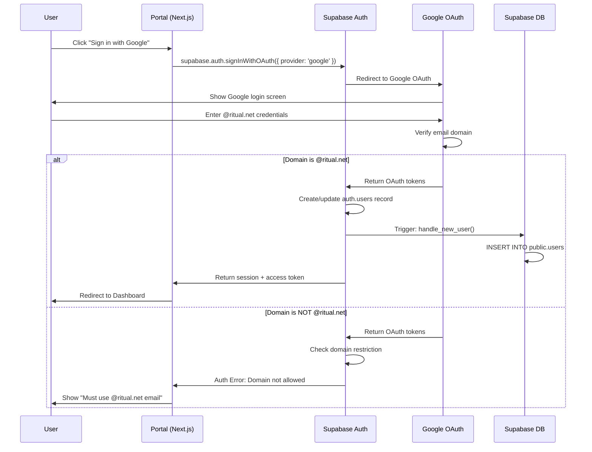
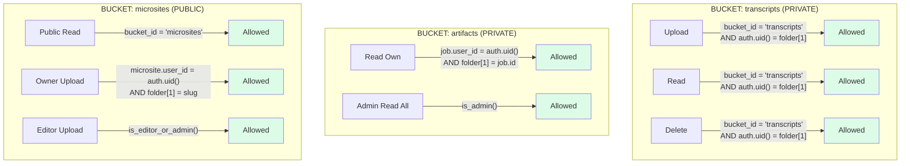

# MAP: Authentication & Authorization

**Parent:** [MASTER_MAP.md](../MASTER_MAP.md)
**Version:** 1.0.0
**Last Updated:** 2026-01-16

---

## 1. Authentication Overview

```
┌─────────────────────────────────────────────────────────────────────────────────┐
│                         AUTHENTICATION ARCHITECTURE                              │
├─────────────────────────────────────────────────────────────────────────────────┤
│                                                                                  │
│                                                                                  │
│                         ┌─────────────────────────────┐                         │
│                         │         USERS               │                         │
│                         │                             │                         │
│                         │  ┌─────────────────────┐   │                         │
│                         │  │ Portal Users        │   │                         │
│                         │  │ (Google OAuth)      │   │                         │
│                         │  │ @ritual.net only    │   │                         │
│                         │  └─────────┬───────────┘   │                         │
│                         │            │               │                         │
│                         │  ┌─────────▼───────────┐   │                         │
│                         │  │ CLI Users           │   │                         │
│                         │  │ (Service Role Key)  │   │                         │
│                         │  │ Bypasses RLS        │   │                         │
│                         │  └─────────────────────┘   │                         │
│                         │                             │                         │
│                         └─────────────┬───────────────┘                         │
│                                       │                                          │
│                                       ▼                                          │
│            ┌──────────────────────────────────────────────────────┐             │
│            │                    SUPABASE AUTH                      │             │
│            │                                                       │             │
│            │  ┌────────────────────┐   ┌────────────────────┐    │             │
│            │  │   Google OAuth     │   │   Service Role     │    │             │
│            │  │                    │   │                    │    │             │
│            │  │ • @ritual.net only │   │ • Full DB access   │    │             │
│            │  │ • Creates session  │   │ • Bypasses RLS     │    │             │
│            │  │ • Respects RLS     │   │ • CLI/Pipeline use │    │             │
│            │  │                    │   │                    │    │             │
│            │  └────────┬───────────┘   └─────────┬──────────┘    │             │
│            │           │                         │                │             │
│            │           │    ┌────────────────────┘                │             │
│            │           │    │                                     │             │
│            │           ▼    ▼                                     │             │
│            │     ┌──────────────┐                                 │             │
│            │     │  auth.users  │                                 │             │
│            │     │              │                                 │             │
│            │     │ • id (uuid)  │───────► Trigger creates         │             │
│            │     │ • email      │         public.users record     │             │
│            │     │ • metadata   │                                 │             │
│            │     └──────────────┘                                 │             │
│            │                                                       │             │
│            └───────────────────────────────────────────────────────┘             │
│                                       │                                          │
│                                       ▼                                          │
│            ┌──────────────────────────────────────────────────────┐             │
│            │                   DATABASE (RLS)                       │             │
│            │                                                       │             │
│            │   Policies check: auth.uid() = user_id                │             │
│            │   Or: public.is_admin() / public.is_editor_or_admin() │             │
│            │                                                       │             │
│            └───────────────────────────────────────────────────────┘             │
│                                                                                  │
└─────────────────────────────────────────────────────────────────────────────────┘
```

---

## 2. Google OAuth Flow



---

## 3. Key Types

```
┌─────────────────────────────────────────────────────────────────────────────────┐
│                              API KEY TYPES                                       │
├─────────────────────────────────────────────────────────────────────────────────┤
│                                                                                  │
│  ┌─────────────────────────────────────────────────────────────────────────┐   │
│  │                                                                          │   │
│  │  ANON KEY (SUPABASE_ANON_KEY)                                            │   │
│  │  ══════════════════════════════                                          │   │
│  │                                                                          │   │
│  │  Purpose:     Client-side access                                         │   │
│  │  Used by:     Portal (browser), Public API calls                         │   │
│  │  RLS:         RESPECTS Row Level Security                                │   │
│  │  Auth:        Requires user session for protected data                   │   │
│  │                                                                          │   │
│  │  Capabilities:                                                           │   │
│  │  ✓ Read public microsites                                                │   │
│  │  ✓ Read data user owns (with session)                                    │   │
│  │  ✓ Create data as authenticated user                                     │   │
│  │  ✗ Cannot read other users' private data                                 │   │
│  │  ✗ Cannot bypass RLS policies                                            │   │
│  │                                                                          │   │
│  │  Example header:                                                         │   │
│  │  Authorization: Bearer <anon_key>                                        │   │
│  │  apikey: <anon_key>                                                      │   │
│  │                                                                          │   │
│  └─────────────────────────────────────────────────────────────────────────┘   │
│                                                                                  │
│  ┌─────────────────────────────────────────────────────────────────────────┐   │
│  │                                                                          │   │
│  │  SERVICE ROLE KEY (SUPABASE_SERVICE_KEY)                                 │   │
│  │  ═══════════════════════════════════════                                 │   │
│  │                                                                          │   │
│  │  Purpose:     Server-side / CLI access                                   │   │
│  │  Used by:     Pipeline CLI, Background jobs, Admin scripts               │   │
│  │  RLS:         BYPASSES Row Level Security                                │   │
│  │  Auth:        No user session required                                   │   │
│  │                                                                          │   │
│  │  Capabilities:                                                           │   │
│  │  ✓ Full read/write to all tables                                         │   │
│  │  ✓ Execute any database operation                                        │   │
│  │  ✓ Manage storage buckets                                                │   │
│  │  ⚠ Must NEVER be exposed to client                                       │   │
│  │  ⚠ Keep in .env, never commit                                            │   │
│  │                                                                          │   │
│  │  Example header:                                                         │   │
│  │  Authorization: Bearer <service_role_key>                                │   │
│  │  apikey: <service_role_key>                                              │   │
│  │                                                                          │   │
│  └─────────────────────────────────────────────────────────────────────────┘   │
│                                                                                  │
└─────────────────────────────────────────────────────────────────────────────────┘
```

---

## 4. Role Hierarchy

```
┌─────────────────────────────────────────────────────────────────────────────────┐
│                              ROLE HIERARCHY                                      │
├─────────────────────────────────────────────────────────────────────────────────┤
│                                                                                  │
│                          ┌─────────────────────┐                                │
│                          │       ADMIN         │                                │
│                          │                     │                                │
│                          │  • Full system      │                                │
│                          │  • Manage users     │                                │
│                          │  • All editor perms │                                │
│                          │  • System settings  │                                │
│                          └──────────┬──────────┘                                │
│                                     │                                           │
│                                     │ inherits                                  │
│                                     ▼                                           │
│                          ┌─────────────────────┐                                │
│                          │       EDITOR        │                                │
│                          │                     │                                │
│                          │  • Edit any content │                                │
│                          │  • Manage entities  │                                │
│                          │  • Merge duplicates │                                │
│                          │  • All contrib perms│                                │
│                          └──────────┬──────────┘                                │
│                                     │                                           │
│                                     │ inherits                                  │
│                                     ▼                                           │
│                          ┌─────────────────────┐                                │
│                          │     CONTRIBUTOR     │                                │
│                          │      (default)      │                                │
│                          │                     │                                │
│                          │  • Generate sites   │                                │
│                          │  • View all content │                                │
│                          │  • Edit own content │                                │
│                          │  • View entities    │                                │
│                          └─────────────────────┘                                │
│                                                                                  │
│                                                                                  │
│  PERMISSION MATRIX                                                               │
│  ═════════════════                                                               │
│                                                                                  │
│  Action                          │ Contributor │ Editor │ Admin                 │
│  ────────────────────────────────┼─────────────┼────────┼───────                │
│  Generate microsites             │     ✓       │   ✓    │   ✓                   │
│  View all microsites             │     ✓       │   ✓    │   ✓                   │
│  Edit own microsites             │     ✓       │   ✓    │   ✓                   │
│  Edit any microsite              │     ✗       │   ✓    │   ✓                   │
│  View entities                   │     ✓       │   ✓    │   ✓                   │
│  Modify entities                 │     ✗       │   ✓    │   ✓                   │
│  Merge/delete entities           │     ✗       │   ✓    │   ✓                   │
│  View all users                  │     ✗       │   ✗    │   ✓                   │
│  Modify user roles               │     ✗       │   ✗    │   ✓                   │
│  System settings                 │     ✗       │   ✗    │   ✓                   │
│                                                                                  │
└─────────────────────────────────────────────────────────────────────────────────┘
```

---

## 5. RLS Policy Matrix

```
┌─────────────────────────────────────────────────────────────────────────────────┐
│                         ROW LEVEL SECURITY POLICIES                              │
├─────────────────────────────────────────────────────────────────────────────────┤
│                                                                                  │
│  TABLE: users                                                                    │
│  ════════════                                                                    │
│  ┌───────────────────────────────────────────────────────────────────────────┐ │
│  │ Policy                    │ Operation │ Check                             │ │
│  │───────────────────────────┼───────────┼───────────────────────────────────│ │
│  │ Users can read own        │ SELECT    │ auth.uid() = id                   │ │
│  │ Users can update own      │ UPDATE    │ auth.uid() = id                   │ │
│  │ Admins can read all       │ SELECT    │ public.is_admin()                 │ │
│  └───────────────────────────────────────────────────────────────────────────┘ │
│                                                                                  │
│  TABLE: generation_jobs                                                          │
│  ══════════════════════                                                          │
│  ┌───────────────────────────────────────────────────────────────────────────┐ │
│  │ Policy                    │ Operation │ Check                             │ │
│  │───────────────────────────┼───────────┼───────────────────────────────────│ │
│  │ Users can create jobs     │ INSERT    │ auth.uid() = user_id              │ │
│  │ Users can view own jobs   │ SELECT    │ auth.uid() = user_id              │ │
│  │ Admins can view all jobs  │ SELECT    │ public.is_admin()                 │ │
│  └───────────────────────────────────────────────────────────────────────────┘ │
│                                                                                  │
│  TABLE: artifacts                                                                │
│  ════════════════                                                                │
│  ┌───────────────────────────────────────────────────────────────────────────┐ │
│  │ Policy                    │ Operation │ Check                             │ │
│  │───────────────────────────┼───────────┼───────────────────────────────────│ │
│  │ Users can view own        │ SELECT    │ job.user_id = auth.uid()          │ │
│  │ Admins can view all       │ SELECT    │ public.is_admin()                 │ │
│  └───────────────────────────────────────────────────────────────────────────┘ │
│                                                                                  │
│  TABLE: microsites                                                               │
│  ═════════════════                                                               │
│  ┌───────────────────────────────────────────────────────────────────────────┐ │
│  │ Policy                    │ Operation │ Check                             │ │
│  │───────────────────────────┼───────────┼───────────────────────────────────│ │
│  │ Auth can view internal    │ SELECT    │ auth.uid() IS NOT NULL            │ │
│  │                           │           │ AND visibility = 'internal'       │ │
│  │ Anyone can view public    │ SELECT    │ visibility = 'public'             │ │
│  │ Users can edit own        │ UPDATE    │ auth.uid() = user_id              │ │
│  │ Editors can edit any      │ UPDATE    │ public.is_editor_or_admin()       │ │
│  │ Users can create          │ INSERT    │ auth.uid() = user_id              │ │
│  └───────────────────────────────────────────────────────────────────────────┘ │
│                                                                                  │
│  TABLE: entities                                                                 │
│  ═══════════════                                                                 │
│  ┌───────────────────────────────────────────────────────────────────────────┐ │
│  │ Policy                    │ Operation │ Check                             │ │
│  │───────────────────────────┼───────────┼───────────────────────────────────│ │
│  │ Auth can view all         │ SELECT    │ auth.uid() IS NOT NULL            │ │
│  │ Editors can modify        │ ALL       │ public.is_editor_or_admin()       │ │
│  └───────────────────────────────────────────────────────────────────────────┘ │
│                                                                                  │
│  TABLE: entity_appearances, entity_relations, opportunities, entity_opp         │
│  ═══════════════════════════════════════════════════════════════════════════    │
│  ┌───────────────────────────────────────────────────────────────────────────┐ │
│  │ Policy                    │ Operation │ Check                             │ │
│  │───────────────────────────┼───────────┼───────────────────────────────────│ │
│  │ Auth can view all         │ SELECT    │ auth.uid() IS NOT NULL            │ │
│  │ Editors can modify        │ ALL       │ public.is_editor_or_admin()       │ │
│  └───────────────────────────────────────────────────────────────────────────┘ │
│                                                                                  │
│                                                                                  │
│  HELPER FUNCTIONS (SECURITY DEFINER)                                            │
│  ═══════════════════════════════════                                            │
│                                                                                  │
│  ┌───────────────────────────────────────────────────────────────────────────┐ │
│  │                                                                           │ │
│  │  public.is_admin() RETURNS boolean                                        │ │
│  │  ─────────────────────────────────                                        │ │
│  │  Returns TRUE if current user has role = 'admin'                          │ │
│  │  Uses SECURITY DEFINER to avoid RLS recursion                             │ │
│  │                                                                           │ │
│  │  public.is_editor_or_admin() RETURNS boolean                              │ │
│  │  ───────────────────────────────────────────                              │ │
│  │  Returns TRUE if current user has role IN ('editor', 'admin')             │ │
│  │  Uses SECURITY DEFINER to avoid RLS recursion                             │ │
│  │                                                                           │ │
│  └───────────────────────────────────────────────────────────────────────────┘ │
│                                                                                  │
└─────────────────────────────────────────────────────────────────────────────────┘
```

---

## 6. Storage Bucket Policies



---

## 7. Session Flow

```
┌─────────────────────────────────────────────────────────────────────────────────┐
│                              SESSION LIFECYCLE                                   │
├─────────────────────────────────────────────────────────────────────────────────┤
│                                                                                  │
│                                                                                  │
│    ┌───────────┐         ┌───────────┐         ┌───────────┐                   │
│    │  Login    │────────►│  Active   │────────►│  Expired  │                   │
│    │           │         │  Session  │         │           │                   │
│    └───────────┘         └─────┬─────┘         └─────┬─────┘                   │
│                                │                     │                          │
│                                │ API calls           │ Token refresh            │
│                                ▼                     ▼                          │
│                         ┌───────────┐         ┌───────────┐                    │
│                         │  Supabase │         │  Refresh  │                    │
│                         │ validates │         │  Token    │                    │
│                         │  JWT      │         │           │                    │
│                         └─────┬─────┘         └─────┬─────┘                    │
│                               │                     │                           │
│                    ┌──────────┴──────────┐         │                           │
│                    │                     │         │                           │
│                    ▼                     ▼         ▼                           │
│              ┌───────────┐         ┌───────────┐ ┌───────────┐                 │
│              │  Valid    │         │  Invalid  │ │  New      │                 │
│              │           │         │           │ │  Session  │                 │
│              └─────┬─────┘         └─────┬─────┘ └───────────┘                 │
│                    │                     │                                      │
│                    ▼                     ▼                                      │
│              ┌───────────┐         ┌───────────┐                               │
│              │  Execute  │         │  401      │                               │
│              │  Request  │         │  Error    │                               │
│              └───────────┘         └───────────┘                               │
│                                                                                  │
│                                                                                  │
│  TOKEN STRUCTURE                                                                 │
│  ═══════════════                                                                 │
│                                                                                  │
│  JWT Payload:                                                                    │
│  {                                                                               │
│    "aud": "authenticated",                                                       │
│    "exp": 1768588857,                                                            │
│    "sub": "46aba85d-2da5-41e9-ad30-d71bd0231039",  // user id                   │
│    "email": "user@ritual.net",                                                   │
│    "role": "authenticated",                                                      │
│    "app_metadata": {                                                             │
│      "provider": "google"                                                        │
│    }                                                                             │
│  }                                                                               │
│                                                                                  │
└─────────────────────────────────────────────────────────────────────────────────┘
```

---

## Related Maps

| Map | Focus |
|-----|-------|
| [MASTER_MAP.md](../MASTER_MAP.md) | System overview |
| [MAP_PIPELINE.md](./MAP_PIPELINE.md) | Processing flow |
| [MAP_DATA.md](./MAP_DATA.md) | Database schema |
| [MAP_INFRASTRUCTURE.md](./MAP_INFRASTRUCTURE.md) | Deployment |

---

*Authentication and authorization visualization for Ritual Research Graph.*
