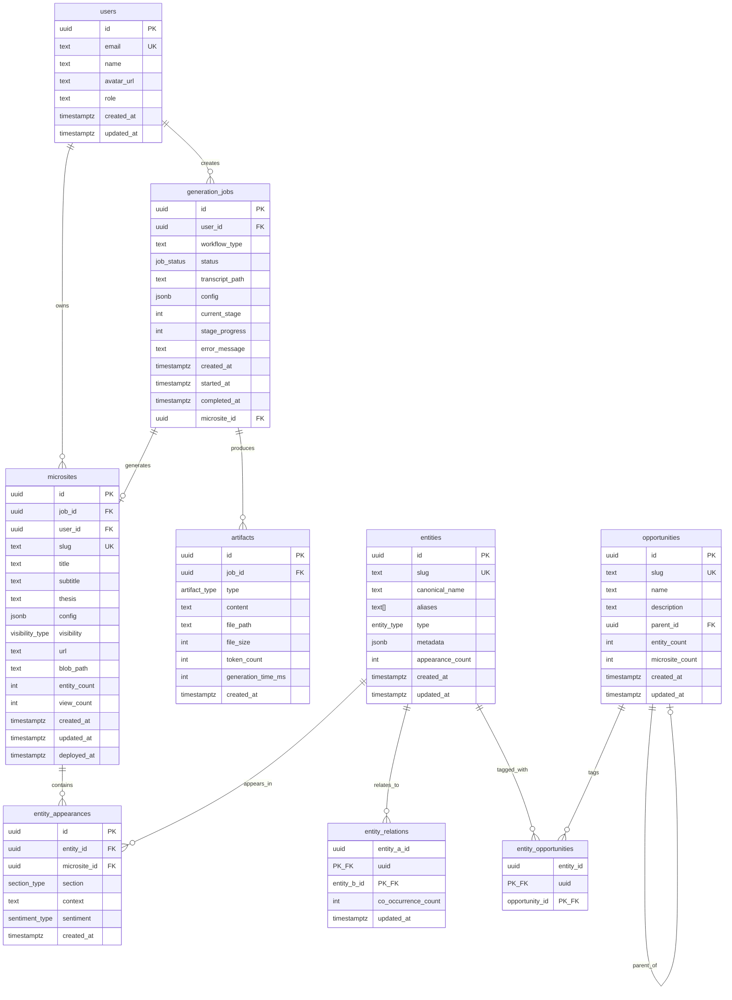
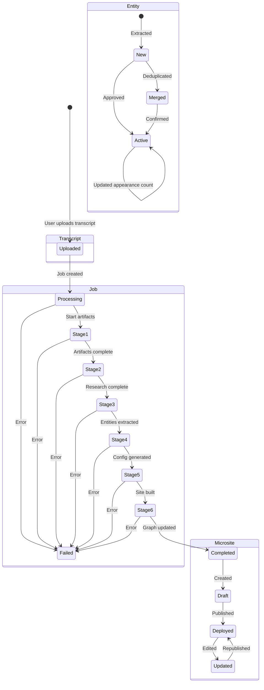

# MAP: Data Architecture

**Parent:** [MASTER_MAP.md](../MASTER_MAP.md)
**Version:** 1.0.0
**Last Updated:** 2026-01-16

---

## 1. Entity Relationship Diagram (ERD)



---

## 2. Table Relationships (ASCII)

```
┌─────────────────────────────────────────────────────────────────────────────────┐
│                          DATABASE SCHEMA RELATIONSHIPS                           │
├─────────────────────────────────────────────────────────────────────────────────┤
│                                                                                  │
│                                                                                  │
│                              ┌───────────────┐                                  │
│                              │     users     │                                  │
│                              │───────────────│                                  │
│                              │ id (PK)       │                                  │
│                              │ email (UK)    │                                  │
│                              │ role          │                                  │
│                              └───────┬───────┘                                  │
│                                      │                                          │
│                        ┌─────────────┴─────────────┐                           │
│                        │                           │                            │
│                        ▼                           ▼                            │
│              ┌───────────────┐           ┌───────────────┐                     │
│              │generation_jobs│           │  microsites   │                     │
│              │───────────────│           │───────────────│                     │
│              │ id (PK)       │──────────►│ id (PK)       │                     │
│              │ user_id (FK)  │           │ job_id (FK)   │                     │
│              │ status        │           │ user_id (FK)  │                     │
│              │ microsite_id  │◄──────────│ slug (UK)     │                     │
│              └───────┬───────┘           │ config (JSONB)│                     │
│                      │                   └───────┬───────┘                     │
│                      │                           │                              │
│                      ▼                           │                              │
│              ┌───────────────┐                   │                              │
│              │   artifacts   │                   │                              │
│              │───────────────│                   │                              │
│              │ id (PK)       │                   │                              │
│              │ job_id (FK)   │                   │                              │
│              │ type          │                   │                              │
│              │ content       │                   │                              │
│              └───────────────┘                   │                              │
│                                                  │                              │
│                                                  │                              │
│              ┌───────────────┐                   │                              │
│              │   entities    │                   │                              │
│              │───────────────│                   │                              │
│              │ id (PK)       │◄──────────────────┤                              │
│              │ slug (UK)     │                   │                              │
│              │ canonical_name│                   │                              │
│              │ type          │                   │                              │
│              │ metadata      │                   │                              │
│              │ appearance_cnt│                   │                              │
│              └───────┬───────┘                   │                              │
│                      │                           │                              │
│         ┌────────────┼────────────┐              │                              │
│         │            │            │              │                              │
│         ▼            ▼            ▼              ▼                              │
│  ┌─────────────┐ ┌─────────────┐ ┌──────────────────────┐                      │
│  │entity_      │ │entity_      │ │ entity_appearances   │                      │
│  │relations    │ │opportunities│ │──────────────────────│                      │
│  │─────────────│ │─────────────│ │ id (PK)              │                      │
│  │entity_a (FK)│ │entity_id(FK)│ │ entity_id (FK) ──────┼──► entities          │
│  │entity_b (FK)│ │opportunity  │ │ microsite_id (FK) ───┼──► microsites        │
│  │co_occur_cnt │ │  _id (FK)   │ │ section              │                      │
│  └─────────────┘ └──────┬──────┘ │ sentiment            │                      │
│                         │        └──────────────────────┘                      │
│                         │                                                       │
│                         ▼                                                       │
│                  ┌─────────────┐                                                │
│                  │opportunities│                                                │
│                  │─────────────│                                                │
│                  │ id (PK)     │◄───┐                                          │
│                  │ slug (UK)   │    │ (self-ref)                               │
│                  │ name        │    │                                          │
│                  │ parent_id ──┼────┘                                          │
│                  └─────────────┘                                                │
│                                                                                  │
└─────────────────────────────────────────────────────────────────────────────────┘
```

---

## 3. Enum Types

```
┌─────────────────────────────────────────────────────────────────────────────────┐
│                              ENUM TYPES                                          │
├─────────────────────────────────────────────────────────────────────────────────┤
│                                                                                  │
│  job_status                                                                      │
│  ══════════                                                                      │
│  ┌─────────────────────────────────────────────────────────────────────────┐   │
│  │ pending → generating_artifacts → extracting_entities →                   │   │
│  │ awaiting_entity_review → generating_site_config → building →            │   │
│  │ deploying → completed                                                    │   │
│  │                    ↓                                                     │   │
│  │                 failed                                                   │   │
│  └─────────────────────────────────────────────────────────────────────────┘   │
│                                                                                  │
│  artifact_type                                                                   │
│  ═════════════                                                                   │
│  ┌─────────────────────────────────────────────────────────────────────────┐   │
│  │ cleaned_transcript | intelligence_brief | strategic_questions |          │   │
│  │ narrative_research | entity_extraction | site_config                     │   │
│  └─────────────────────────────────────────────────────────────────────────┘   │
│                                                                                  │
│  entity_type                                                                     │
│  ═══════════                                                                     │
│  ┌─────────────────────────────────────────────────────────────────────────┐   │
│  │ company | protocol | person | concept | opportunity                      │   │
│  └─────────────────────────────────────────────────────────────────────────┘   │
│                                                                                  │
│  visibility_type                                                                 │
│  ═══════════════                                                                 │
│  ┌─────────────────────────────────────────────────────────────────────────┐   │
│  │ internal | public                                                        │   │
│  └─────────────────────────────────────────────────────────────────────────┘   │
│                                                                                  │
│  section_type                                                                    │
│  ════════════                                                                    │
│  ┌─────────────────────────────────────────────────────────────────────────┐   │
│  │ thesis | key_findings | recommendations | deep_dives                     │   │
│  └─────────────────────────────────────────────────────────────────────────┘   │
│                                                                                  │
│  sentiment_type                                                                  │
│  ══════════════                                                                  │
│  ┌─────────────────────────────────────────────────────────────────────────┐   │
│  │ positive | neutral | negative                                            │   │
│  └─────────────────────────────────────────────────────────────────────────┘   │
│                                                                                  │
└─────────────────────────────────────────────────────────────────────────────────┘
```

---

## 4. Storage Architecture

```
┌─────────────────────────────────────────────────────────────────────────────────┐
│                           STORAGE ARCHITECTURE                                   │
├─────────────────────────────────────────────────────────────────────────────────┤
│                                                                                  │
│  SUPABASE STORAGE BUCKETS                                                        │
│  ════════════════════════                                                        │
│                                                                                  │
│  ┌─────────────────────────────────────────────────────────────────────────┐   │
│  │ BUCKET: transcripts (PRIVATE)                                            │   │
│  │ ─────────────────────────────                                            │   │
│  │                                                                          │   │
│  │ Structure: /{user_id}/{job_id}.md                                        │   │
│  │                                                                          │   │
│  │ Example:                                                                 │   │
│  │ /46aba85d-2da5-41e9-ad30-d71bd0231039/                                  │   │
│  │   └── abc123-def456.md                                                   │   │
│  │                                                                          │   │
│  │ RLS: Users can only access their own transcripts                         │   │
│  └─────────────────────────────────────────────────────────────────────────┘   │
│                                                                                  │
│  ┌─────────────────────────────────────────────────────────────────────────┐   │
│  │ BUCKET: artifacts (PRIVATE)                                              │   │
│  │ ──────────────────────────                                               │   │
│  │                                                                          │   │
│  │ Structure: /{job_id}/{artifact_type}.md                                  │   │
│  │                                                                          │   │
│  │ Example:                                                                 │   │
│  │ /abc123-def456/                                                          │   │
│  │   ├── cleaned_transcript.md                                              │   │
│  │   ├── intelligence_brief.md                                              │   │
│  │   ├── strategic_questions.md                                             │   │
│  │   └── narrative_research.md                                              │   │
│  │                                                                          │   │
│  │ RLS: Users can access artifacts for their own jobs                       │   │
│  │ Admins: Full access                                                      │   │
│  └─────────────────────────────────────────────────────────────────────────┘   │
│                                                                                  │
│  ┌─────────────────────────────────────────────────────────────────────────┐   │
│  │ BUCKET: microsites (PUBLIC)                                              │   │
│  │ ─────────────────────────                                                │   │
│  │                                                                          │   │
│  │ Structure: /{slug}/                                                      │   │
│  │                                                                          │   │
│  │ Example:                                                                 │   │
│  │ /rwa-defi-jan-2026/                                                      │   │
│  │   ├── index.html                                                         │   │
│  │   ├── assets/                                                            │   │
│  │   │   ├── index-abc123.js                                                │   │
│  │   │   └── index-def456.css                                               │   │
│  │   └── public/                                                            │   │
│  │       ├── cleaned_transcript.md                                          │   │
│  │       ├── intelligence_brief.md                                          │   │
│  │       ├── strategic_questions.md                                         │   │
│  │       └── narrative_research.md                                          │   │
│  │                                                                          │   │
│  │ RLS: Public read, owner + editor write                                   │   │
│  └─────────────────────────────────────────────────────────────────────────┘   │
│                                                                                  │
│                                                                                  │
│  VERCEL BLOB (Alternative/Overflow)                                             │
│  ═══════════════════════════════════                                            │
│                                                                                  │
│  ┌─────────────────────────────────────────────────────────────────────────┐   │
│  │ /microsites/{slug}/                                                      │   │
│  │   └── (static site files)                                                │   │
│  │                                                                          │   │
│  │ Used for: Deployed microsites served via Vercel edge                     │   │
│  │ Access: Public CDN                                                       │   │
│  └─────────────────────────────────────────────────────────────────────────┘   │
│                                                                                  │
└─────────────────────────────────────────────────────────────────────────────────┘
```

---

## 5. Data Lifecycle States



---

## 6. Index Strategy

```
┌─────────────────────────────────────────────────────────────────────────────────┐
│                              INDEX STRATEGY                                      │
├─────────────────────────────────────────────────────────────────────────────────┤
│                                                                                  │
│  PRIMARY INDEXES (B-Tree)                                                        │
│  ════════════════════════                                                        │
│                                                                                  │
│  Table               Index                    Purpose                            │
│  ─────────────────────────────────────────────────────────────────────────────  │
│  users               idx_users_email          Email lookup                       │
│  generation_jobs     idx_jobs_user            User's jobs                        │
│  generation_jobs     idx_jobs_status          Filter by status                   │
│  generation_jobs     idx_jobs_user_created    User's jobs sorted                 │
│  artifacts           idx_artifacts_job        Job's artifacts                    │
│  microsites          idx_microsites_slug      Slug lookup                        │
│  microsites          idx_microsites_user      User's microsites                  │
│  microsites          idx_microsites_vis       Visibility filter                  │
│  entities            idx_entities_slug        Slug lookup                        │
│  entities            idx_entities_type        Type filter                        │
│  entity_appearances  idx_appearances_entity   Entity's appearances              │
│  entity_appearances  idx_appearances_micro    Microsite's entities              │
│  entity_relations    idx_relations_a          Relations by entity A             │
│  entity_relations    idx_relations_b          Relations by entity B             │
│  entity_relations    idx_relations_count      Top co-occurrences                │
│  opportunities       idx_opp_slug             Slug lookup                        │
│  opportunities       idx_opp_parent           Children lookup                    │
│                                                                                  │
│                                                                                  │
│  FULL-TEXT SEARCH INDEXES (GIN)                                                 │
│  ══════════════════════════════                                                  │
│                                                                                  │
│  Table               Index                    Column                             │
│  ─────────────────────────────────────────────────────────────────────────────  │
│  entities            idx_entities_name_trgm   canonical_name (trigram)          │
│  entities            idx_entities_aliases     aliases (array)                    │
│  microsites          idx_microsites_title     title (trigram)                    │
│  microsites          idx_microsites_thesis    thesis_tsv (tsvector)             │
│                                                                                  │
│                                                                                  │
│  COMPOSITE INDEXES                                                               │
│  ═════════════════                                                               │
│                                                                                  │
│  Table                  Index                        Columns                     │
│  ─────────────────────────────────────────────────────────────────────────────  │
│  entity_appearances     idx_appear_micro_entity      (microsite_id, entity_id)  │
│                                                                                  │
└─────────────────────────────────────────────────────────────────────────────────┘
```

---

## 7. Trigger Functions

```
┌─────────────────────────────────────────────────────────────────────────────────┐
│                            TRIGGER FUNCTIONS                                     │
├─────────────────────────────────────────────────────────────────────────────────┤
│                                                                                  │
│  1. update_updated_at()                                                          │
│     ═══════════════════                                                          │
│     Tables: users, microsites, entities, opportunities                           │
│     When: BEFORE UPDATE                                                          │
│     Action: SET NEW.updated_at = NOW()                                           │
│                                                                                  │
│  2. update_entity_appearance_count()                                             │
│     ════════════════════════════════                                             │
│     Tables: entity_appearances                                                   │
│     When: AFTER INSERT OR DELETE                                                 │
│     Action: UPDATE entities SET appearance_count = count(*)                      │
│                                                                                  │
│  3. update_opportunity_counts()                                                  │
│     ═══════════════════════════                                                  │
│     Tables: entity_opportunities                                                 │
│     When: AFTER INSERT OR DELETE                                                 │
│     Action: UPDATE opportunities SET entity_count, microsite_count               │
│                                                                                  │
│  4. handle_new_user()                                                            │
│     ═════════════════                                                            │
│     Tables: auth.users                                                           │
│     When: AFTER INSERT                                                           │
│     Action: INSERT INTO public.users (from auth metadata)                        │
│                                                                                  │
└─────────────────────────────────────────────────────────────────────────────────┘
```

---

## Related Maps

| Map | Focus |
|-----|-------|
| [MASTER_MAP.md](../MASTER_MAP.md) | System overview |
| [MAP_PIPELINE.md](./MAP_PIPELINE.md) | Processing flow |
| [MAP_AUTH.md](./MAP_AUTH.md) | RLS policies |
| [MAP_INFRASTRUCTURE.md](./MAP_INFRASTRUCTURE.md) | Deployment |

---

*Data architecture visualization for Ritual Research Graph.*
