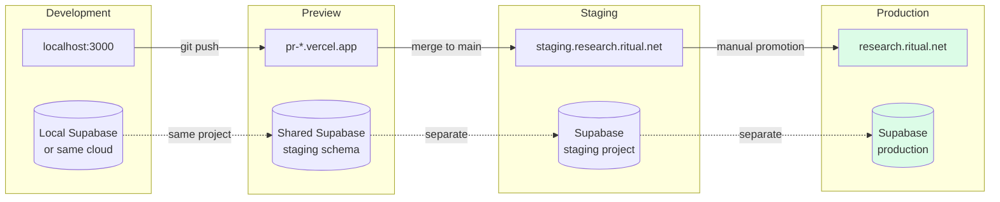
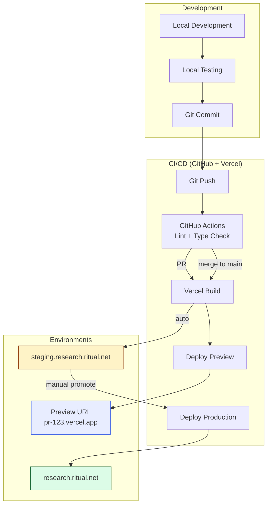
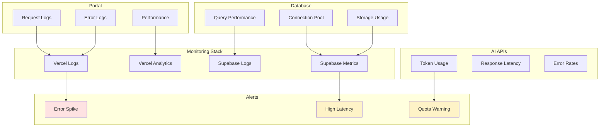

# MAP: Infrastructure & Deployment

**Parent:** [MASTER_MAP.md](../MASTER_MAP.md)
**Version:** 1.0.0
**Last Updated:** 2026-01-16

---

## 1. Service Topology

```
┌─────────────────────────────────────────────────────────────────────────────────┐
│                          SERVICE TOPOLOGY                                        │
├─────────────────────────────────────────────────────────────────────────────────┤
│                                                                                  │
│                                                                                  │
│    EXTERNAL SERVICES                                                             │
│    ═════════════════                                                             │
│                                                                                  │
│    ┌─────────────┐   ┌─────────────┐   ┌─────────────┐   ┌─────────────┐       │
│    │   Google    │   │  Anthropic  │   │    xAI      │   │ Perplexity  │       │
│    │   OAuth     │   │   Claude    │   │    Grok     │   │   Sonar     │       │
│    │             │   │             │   │             │   │             │       │
│    │ Identity    │   │ PRIMARY AI  │   │ Real-time   │   │ Deep        │       │
│    │ Provider    │   │ Reasoning   │   │ Context     │   │ Research    │       │
│    └──────┬──────┘   └──────┬──────┘   └──────┬──────┘   └──────┬──────┘       │
│           │                 │                 │                 │               │
│           │                 └────────┬────────┴────────┬────────┘               │
│           │                          │                 │                        │
│           │                          ▼                 │                        │
│    ┌──────┴────────────────────────────────────────────┴───────────────────┐   │
│    │                                                                        │   │
│    │                           VERCEL                                       │   │
│    │                                                                        │   │
│    │   ┌──────────────────────────────────────────────────────────────┐   │   │
│    │   │                    research.ritual.net                        │   │   │
│    │   │                                                               │   │   │
│    │   │  ┌─────────────────┐    ┌─────────────────────────────────┐ │   │   │
│    │   │  │     Portal      │    │         Microsites               │ │   │   │
│    │   │  │    (Next.js)    │    │      (Static Sites)              │ │   │   │
│    │   │  │                 │    │                                  │ │   │   │
│    │   │  │  /              │    │  /sites/rwa-defi-jan-2026/      │ │   │   │
│    │   │  │  /new           │    │  /sites/tokenized-treasuries/   │ │   │   │
│    │   │  │  /microsites    │    │  /sites/private-credit/         │ │   │   │
│    │   │  │  /entities      │    │                                  │ │   │   │
│    │   │  │  /api/*         │    │                                  │ │   │   │
│    │   │  │                 │    │                                  │ │   │   │
│    │   │  └────────┬────────┘    └────────────────┬────────────────┘ │   │   │
│    │   │           │                              │                   │   │   │
│    │   └───────────┼──────────────────────────────┼───────────────────┘   │   │
│    │               │                              │                       │   │
│    │               │                              │                       │   │
│    │   ┌───────────┴──────────────────────────────┴───────────────────┐   │   │
│    │   │                        Vercel Blob                            │   │   │
│    │   │                                                               │   │   │
│    │   │   /microsites/{slug}/     (Static site files)                │   │   │
│    │   │   /artifacts/{job_id}/    (Generated artifacts)              │   │   │
│    │   │                                                               │   │   │
│    │   └───────────────────────────────────────────────────────────────┘   │   │
│    │                                                                        │   │
│    └────────────────────────────────────────┬───────────────────────────────┘   │
│                                             │                                   │
│                                             │                                   │
│    ┌────────────────────────────────────────┴───────────────────────────────┐  │
│    │                                                                         │  │
│    │                            SUPABASE                                     │  │
│    │                                                                         │  │
│    │   ┌─────────────────────────────────────────────────────────────────┐  │  │
│    │   │                      Postgres Database                          │  │  │
│    │   │                                                                 │  │  │
│    │   │   users | generation_jobs | artifacts | microsites | entities  │  │  │
│    │   │   entity_appearances | entity_relations | opportunities        │  │  │
│    │   │                                                                 │  │  │
│    │   │   + RLS Policies                                                │  │  │
│    │   │   + Triggers                                                    │  │  │
│    │   │   + Full-text search                                            │  │  │
│    │   │                                                                 │  │  │
│    │   └─────────────────────────────────────────────────────────────────┘  │  │
│    │                                                                         │  │
│    │   ┌─────────────┐   ┌─────────────┐   ┌─────────────────────────────┐  │  │
│    │   │    Auth     │   │  Realtime   │   │         Storage             │  │  │
│    │   │             │   │             │   │                             │  │  │
│    │   │ Google OAuth│   │ Job status  │   │ transcripts (private)       │  │  │
│    │   │ @ritual.net │   │ updates     │   │ artifacts (private)         │  │  │
│    │   │             │   │             │   │ microsites (public)         │  │  │
│    │   └─────────────┘   └─────────────┘   └─────────────────────────────┘  │  │
│    │                                                                         │  │
│    └─────────────────────────────────────────────────────────────────────────┘  │
│                                                                                  │
│                                                                                  │
│    INTERNAL SERVICES                                                             │
│    ═════════════════                                                             │
│                                                                                  │
│    ┌─────────────────────────────────────────────────────────────────────────┐  │
│    │                                                                          │  │
│    │                         GCP VM (gcp-agentic)                             │  │
│    │                                                                          │  │
│    │   ┌─────────────────────────────────────────────────────────────────┐   │  │
│    │   │                         bird-cli                                 │   │  │
│    │   │                                                                  │   │  │
│    │   │   Twitter data retrieval via SSH                                 │   │  │
│    │   │   • Thread trees                                                 │   │  │
│    │   │   • Engagement metrics                                           │   │  │
│    │   │   • Account activity                                             │   │  │
│    │   │                                                                  │   │  │
│    │   │   Access: SSH from local machine                                 │   │  │
│    │   │   Command: ssh gcp-agentic "bird search ..."                     │   │  │
│    │   │                                                                  │   │  │
│    │   └─────────────────────────────────────────────────────────────────┘   │  │
│    │                                                                          │  │
│    └─────────────────────────────────────────────────────────────────────────┘  │
│                                                                                  │
└─────────────────────────────────────────────────────────────────────────────────┘
```

---

## 2. Environment Progression



---

## 3. Environment Variables by Context

```
┌─────────────────────────────────────────────────────────────────────────────────┐
│                         ENVIRONMENT VARIABLES                                    │
├─────────────────────────────────────────────────────────────────────────────────┤
│                                                                                  │
│  LOCAL DEVELOPMENT (.env)                                                        │
│  ════════════════════════                                                        │
│                                                                                  │
│  # Primary AI (Claude)                                                           │
│  ANTHROPIC_API_KEY=sk-ant-api03-...                                             │
│                                                                                  │
│  # Secondary AI (Enrichment)                                                     │
│  XAI_API_KEY=xai-...                                                            │
│  PERPLEXITY_API_KEY=pplx-...                                                    │
│                                                                                  │
│  # Database                                                                      │
│  SUPABASE_URL=https://grvnvtonghptitgxitkv.supabase.co                          │
│  SUPABASE_ANON_KEY=eyJ...                                                       │
│  SUPABASE_SERVICE_KEY=eyJ...     # CLI/server only                              │
│  SUPABASE_DB_PASSWORD=...        # Direct DB access                             │
│                                                                                  │
│  ───────────────────────────────────────────────────────────────────────────────│
│                                                                                  │
│  VERCEL (Portal)                                                                 │
│  ═══════════════                                                                 │
│                                                                                  │
│  # Set in Vercel Dashboard → Environment Variables                              │
│                                                                                  │
│  ANTHROPIC_API_KEY        → Production, Preview                                 │
│  XAI_API_KEY              → Production, Preview                                 │
│  PERPLEXITY_API_KEY       → Production, Preview                                 │
│  SUPABASE_URL             → Production, Preview (different per env)             │
│  SUPABASE_ANON_KEY        → Production, Preview (different per env)             │
│  SUPABASE_SERVICE_KEY     → Production only (server-side API routes)            │
│                                                                                  │
│  # Never expose service key to client!                                          │
│  NEXT_PUBLIC_SUPABASE_URL       → Client-side                                   │
│  NEXT_PUBLIC_SUPABASE_ANON_KEY  → Client-side                                   │
│                                                                                  │
│  ───────────────────────────────────────────────────────────────────────────────│
│                                                                                  │
│  CLI (Pipeline)                                                                  │
│  ══════════════                                                                  │
│                                                                                  │
│  # Loaded from .env via dotenv                                                  │
│  # Uses SERVICE_KEY to bypass RLS for direct DB writes                          │
│                                                                                  │
│  Required for CLI:                                                              │
│  ✓ ANTHROPIC_API_KEY                                                            │
│  ✓ XAI_API_KEY                                                                  │
│  ✓ PERPLEXITY_API_KEY                                                           │
│  ✓ SUPABASE_URL                                                                 │
│  ✓ SUPABASE_SERVICE_KEY    # NOT anon key!                                      │
│                                                                                  │
└─────────────────────────────────────────────────────────────────────────────────┘
```

---

## 4. Deployment Flow



---

## 5. Connection Diagram

```
┌─────────────────────────────────────────────────────────────────────────────────┐
│                          CONNECTION DIAGRAM                                      │
├─────────────────────────────────────────────────────────────────────────────────┤
│                                                                                  │
│                                                                                  │
│    USER BROWSER                                                                  │
│    ════════════                                                                  │
│         │                                                                        │
│         │ HTTPS                                                                  │
│         ▼                                                                        │
│    ┌─────────────────────────────────────────────────────────────────────────┐  │
│    │                         VERCEL EDGE                                      │  │
│    │                                                                          │  │
│    │   ┌─────────────────────────────────────────────────────────────────┐   │  │
│    │   │                    research.ritual.net                           │   │  │
│    │   │                                                                  │   │  │
│    │   │   /                    → Next.js SSR                            │   │  │
│    │   │   /api/*               → Next.js API Routes                     │   │  │
│    │   │   /sites/*             → Static from Blob                       │   │  │
│    │   │   /_next/static/*      → CDN cached                             │   │  │
│    │   │                                                                  │   │  │
│    │   └──────────────────────────────┬──────────────────────────────────┘   │  │
│    │                                  │                                       │  │
│    └──────────────────────────────────┼───────────────────────────────────────┘  │
│                                       │                                          │
│                     ┌─────────────────┼─────────────────┐                       │
│                     │                 │                 │                        │
│                     ▼                 ▼                 ▼                        │
│              ┌───────────┐     ┌───────────┐     ┌───────────┐                  │
│              │  Supabase │     │  Vercel   │     │    AI     │                  │
│              │    REST   │     │   Blob    │     │ Providers │                  │
│              │           │     │           │     │           │                  │
│              │ Port 443  │     │ CDN Edge  │     │ Port 443  │                  │
│              │           │     │           │     │           │                  │
│              └─────┬─────┘     └───────────┘     └─────┬─────┘                  │
│                    │                                   │                         │
│                    │                                   │                         │
│                    ▼                                   │                         │
│              ┌───────────┐                             │                         │
│              │  Postgres │                             │                         │
│              │  Port 5432│                             │                         │
│              │ (pooler)  │                             │                         │
│              └───────────┘                             │                         │
│                                                        │                         │
│                                                        │                         │
│    CLI (Local Machine)                                 │                         │
│    ═══════════════════                                 │                         │
│         │                                              │                         │
│         │ HTTPS (Service Key)                          │                         │
│         ├──────────────────────────────────────────────┤                         │
│         │                                              │                         │
│         │ SSH                                          │                         │
│         ▼                                              │                         │
│    ┌───────────┐                                       │                         │
│    │  GCP VM   │                                       │                         │
│    │ bird-cli  │                                       │                         │
│    │ Port 22   │                                       │                         │
│    └───────────┘                                       │                         │
│                                                        │                         │
│                                                        │                         │
│    PROTOCOL SUMMARY                                                              │
│    ═════════════════                                                             │
│                                                                                  │
│    ┌─────────────────────────────────────────────────────────────────────────┐  │
│    │ Connection           │ Protocol │ Port │ Auth                           │  │
│    │──────────────────────┼──────────┼──────┼────────────────────────────────│  │
│    │ Browser → Vercel     │ HTTPS    │ 443  │ Session cookie                 │  │
│    │ Portal → Supabase    │ HTTPS    │ 443  │ anon key + JWT                 │  │
│    │ Portal → AI APIs     │ HTTPS    │ 443  │ API keys (server-side)         │  │
│    │ CLI → Supabase       │ HTTPS    │ 443  │ service key                    │  │
│    │ CLI → AI APIs        │ HTTPS    │ 443  │ API keys                       │  │
│    │ CLI → GCP VM         │ SSH      │ 22   │ SSH key                        │  │
│    │ DB Direct (optional) │ Postgres │ 5432 │ Connection string              │  │
│    └─────────────────────────────────────────────────────────────────────────┘  │
│                                                                                  │
└─────────────────────────────────────────────────────────────────────────────────┘
```

---

## 6. URL Structure

```
┌─────────────────────────────────────────────────────────────────────────────────┐
│                              URL STRUCTURE                                       │
├─────────────────────────────────────────────────────────────────────────────────┤
│                                                                                  │
│  PORTAL (research.ritual.net)                                                    │
│  ════════════════════════════                                                    │
│                                                                                  │
│  /                           Dashboard (requires auth)                           │
│  /new                        Generation wizard                                   │
│  /jobs                       Job queue / status                                  │
│  /jobs/[id]                  Single job detail                                   │
│  /microsites                 Microsite list                                      │
│  /microsites/[slug]          Microsite detail / edit                             │
│  /entities                   Entity registry                                     │
│  /entities/[slug]            Entity detail / appearances                         │
│  /opportunities              Opportunity taxonomy                                │
│  /settings                   User settings                                       │
│                                                                                  │
│  /api/generate               POST - Start generation                             │
│  /api/jobs/[id]              GET - Job status                                    │
│  /api/entities               GET/POST - Entity CRUD                              │
│                                                                                  │
│  ───────────────────────────────────────────────────────────────────────────────│
│                                                                                  │
│  MICROSITES (research.ritual.net/sites/*)                                        │
│  ════════════════════════════════════════                                        │
│                                                                                  │
│  /sites/[slug]/              Static microsite (index.html)                       │
│  /sites/[slug]/public/*.md   Artifact files                                      │
│  /sites/[slug]/assets/*      JS/CSS bundles                                      │
│                                                                                  │
│  Examples:                                                                       │
│  /sites/rwa-defi-jan-2026/                                                       │
│  /sites/tokenized-treasuries-q1/                                                 │
│  /sites/private-credit-analysis/                                                 │
│                                                                                  │
│  ───────────────────────────────────────────────────────────────────────────────│
│                                                                                  │
│  SUPABASE STORAGE                                                                │
│  ════════════════                                                                │
│                                                                                  │
│  https://[project].supabase.co/storage/v1/object/public/microsites/[slug]/*     │
│  https://[project].supabase.co/storage/v1/object/[bucket]/[path]                │
│                                                                                  │
└─────────────────────────────────────────────────────────────────────────────────┘
```

---

## 7. Monitoring Points



---

## Related Maps

| Map | Focus |
|-----|-------|
| [MASTER_MAP.md](../MASTER_MAP.md) | System overview |
| [MAP_PIPELINE.md](./MAP_PIPELINE.md) | Processing flow |
| [MAP_DATA.md](./MAP_DATA.md) | Database schema |
| [MAP_AUTH.md](./MAP_AUTH.md) | Authentication |

---

*Infrastructure and deployment visualization for Ritual Research Graph.*
