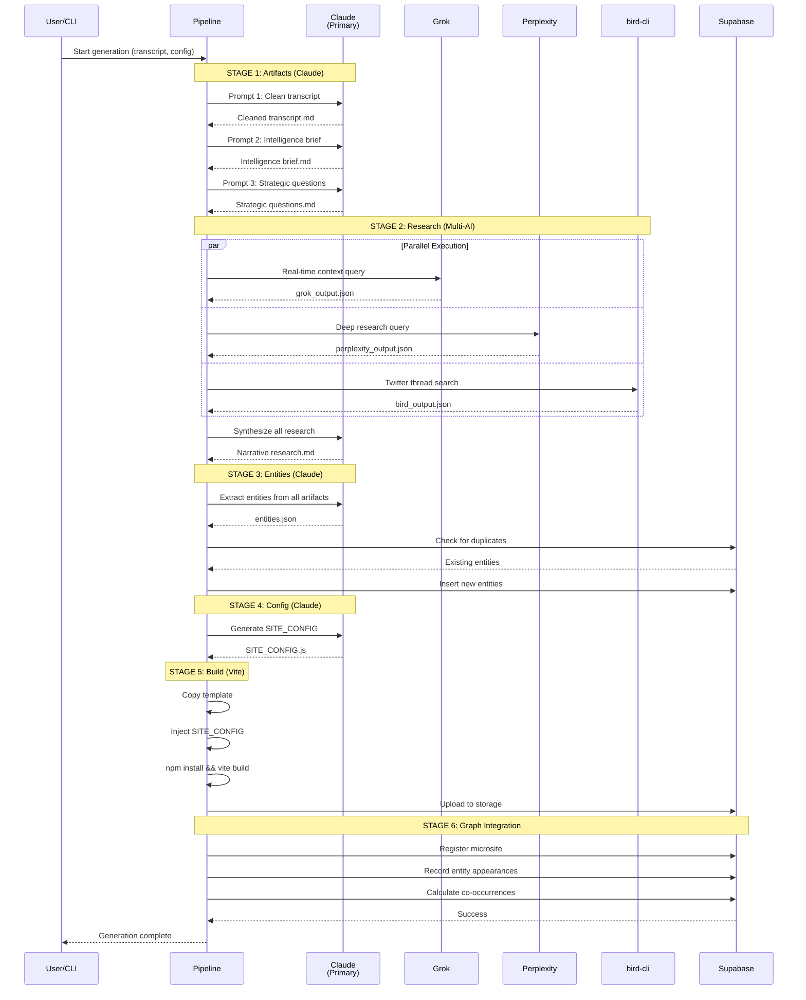
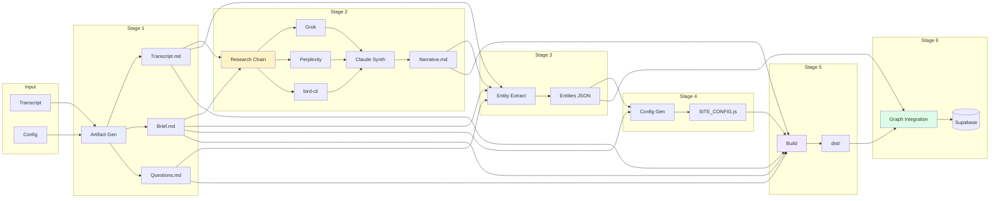
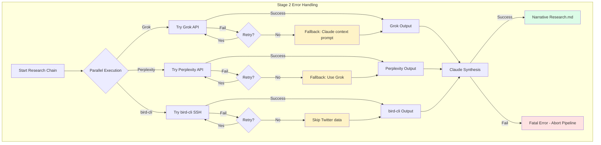

# MAP: Processing Pipeline

**Parent:** [MASTER_MAP.md](../MASTER_MAP.md)
**Version:** 1.0.0
**Last Updated:** 2026-01-16

---

## 1. Pipeline Overview (6 Stages)

```
┌─────────────────────────────────────────────────────────────────────────────────┐
│                         6-STAGE PROCESSING PIPELINE                              │
├─────────────────────────────────────────────────────────────────────────────────┤
│                                                                                  │
│   INPUT                                                                          │
│   ═════                                                                          │
│   [Transcript.md] + [Workflow Config] + [User Config]                           │
│         │                                                                        │
│         ▼                                                                        │
│   ╔═══════════════════════════════════════════════════════════════════════════╗ │
│   ║  STAGE 1: ARTIFACT GENERATION                                             ║ │
│   ║  ─────────────────────────────                                            ║ │
│   ║  Provider: Claude (ANTHROPIC_API_KEY)                                     ║ │
│   ║                                                                           ║ │
│   ║  ┌──────────────┐    ┌──────────────┐    ┌──────────────┐                ║ │
│   ║  │   Prompt 1   │    │   Prompt 2   │    │   Prompt 3   │                ║ │
│   ║  │    Clean     │    │    Brief     │    │  Questions   │                ║ │
│   ║  │  Transcript  │    │              │    │              │                ║ │
│   ║  └──────┬───────┘    └──────┬───────┘    └──────┬───────┘                ║ │
│   ║         │                   │                   │                         ║ │
│   ║         ▼                   ▼                   ▼                         ║ │
│   ║  ┌──────────────┐    ┌──────────────┐    ┌──────────────┐                ║ │
│   ║  │ Transcript   │    │ Intelligence │    │  Strategic   │                ║ │
│   ║  │   Clean.md   │    │   Brief.md   │    │ Questions.md │                ║ │
│   ║  └──────────────┘    └──────────────┘    └──────────────┘                ║ │
│   ║                                                                           ║ │
│   ╚═══════════════════════════════════════════════════════════════════════════╝ │
│         │                                                                        │
│         ▼                                                                        │
│   ╔═══════════════════════════════════════════════════════════════════════════╗ │
│   ║  STAGE 2: MULTI-AI RESEARCH CHAIN                                         ║ │
│   ║  ────────────────────────────────                                         ║ │
│   ║  Providers: Grok → Perplexity → bird-cli → Claude                         ║ │
│   ║                                                                           ║ │
│   ║  ┌─────────────────────────────────────────────────────────────────────┐ ║ │
│   ║  │                    PARALLEL EXECUTION                                │ ║ │
│   ║  │                                                                      │ ║ │
│   ║  │  ┌────────────┐   ┌────────────┐   ┌────────────┐                   │ ║ │
│   ║  │  │   GROK     │   │ PERPLEXITY │   │  BIRD-CLI  │                   │ ║ │
│   ║  │  │            │   │            │   │            │                   │ ║ │
│   ║  │  │ Real-time  │   │   Deep     │   │  Twitter   │                   │ ║ │
│   ║  │  │  Context   │   │  Research  │   │  Threads   │                   │ ║ │
│   ║  │  │            │   │            │   │            │                   │ ║ │
│   ║  │  └─────┬──────┘   └─────┬──────┘   └─────┬──────┘                   │ ║ │
│   ║  │        │                │                │                          │ ║ │
│   ║  │        └────────────────┼────────────────┘                          │ ║ │
│   ║  │                         │                                           │ ║ │
│   ║  │                         ▼                                           │ ║ │
│   ║  │                  ┌────────────┐                                     │ ║ │
│   ║  │                  │   CLAUDE   │                                     │ ║ │
│   ║  │                  │ Synthesis  │                                     │ ║ │
│   ║  │                  └─────┬──────┘                                     │ ║ │
│   ║  │                        │                                            │ ║ │
│   ║  └────────────────────────┼────────────────────────────────────────────┘ ║ │
│   ║                           ▼                                               ║ │
│   ║                    ┌──────────────┐                                       ║ │
│   ║                    │  Narrative   │                                       ║ │
│   ║                    │ Research.md  │                                       ║ │
│   ║                    └──────────────┘                                       ║ │
│   ║                                                                           ║ │
│   ╚═══════════════════════════════════════════════════════════════════════════╝ │
│         │                                                                        │
│         ▼                                                                        │
│   ╔═══════════════════════════════════════════════════════════════════════════╗ │
│   ║  STAGE 3: ENTITY EXTRACTION                                               ║ │
│   ║  ──────────────────────────                                               ║ │
│   ║  Provider: Claude (ANTHROPIC_API_KEY)                                     ║ │
│   ║                                                                           ║ │
│   ║  All Artifacts ──► [Extract Prompt] ──► Entity List (JSON)               ║ │
│   ║                                              │                            ║ │
│   ║                                              ▼                            ║ │
│   ║                                        ┌──────────┐                       ║ │
│   ║                                        │ Dedupe   │                       ║ │
│   ║                                        │ Against  │                       ║ │
│   ║                                        │ Registry │                       ║ │
│   ║                                        └────┬─────┘                       ║ │
│   ║                                             │                             ║ │
│   ║                              ┌──────────────┴──────────────┐              ║ │
│   ║                              ▼                             ▼              ║ │
│   ║                       [New Entities]              [Merge Suggestions]     ║ │
│   ║                              │                             │              ║ │
│   ║                              └──────────────┬──────────────┘              ║ │
│   ║                                             ▼                             ║ │
│   ║                                    Supabase: entities                     ║ │
│   ║                                                                           ║ │
│   ╚═══════════════════════════════════════════════════════════════════════════╝ │
│         │                                                                        │
│         ▼                                                                        │
│   ╔═══════════════════════════════════════════════════════════════════════════╗ │
│   ║  STAGE 4: SITE_CONFIG GENERATION                                          ║ │
│   ║  ───────────────────────────────                                          ║ │
│   ║  Provider: Claude (ANTHROPIC_API_KEY)                                     ║ │
│   ║                                                                           ║ │
│   ║  Artifacts + Entities ──► [Config Prompt] ──► SITE_CONFIG.js              ║ │
│   ║                                                                           ║ │
│   ║  Output Structure:                                                        ║ │
│   ║  ┌─────────────────────────────────────────────────────────────────────┐ ║ │
│   ║  │ • branding: { title, subtitle, accentColor }                        │ ║ │
│   ║  │ • thesis: "Single sentence core insight"                            │ ║ │
│   ║  │ • keyFindings: [ { title, content } × 5-7 ]                         │ ║ │
│   ║  │ • recommendations: [ { title, content } × 6-10 ]                    │ ║ │
│   ║  │ • entities: { name: { url, twitter, providers } }                   │ ║ │
│   ║  │ • deepDives: [ { title, content, collapsed } ]                      │ ║ │
│   ║  │ • sourceArtifacts: [ { title, file } ]                              │ ║ │
│   ║  └─────────────────────────────────────────────────────────────────────┘ ║ │
│   ║                                                                           ║ │
│   ╚═══════════════════════════════════════════════════════════════════════════╝ │
│         │                                                                        │
│         ▼                                                                        │
│   ╔═══════════════════════════════════════════════════════════════════════════╗ │
│   ║  STAGE 5: MICROSITE BUILD                                                 ║ │
│   ║  ────────────────────────                                                 ║ │
│   ║  Provider: Vite (local build)                                             ║ │
│   ║                                                                           ║ │
│   ║  ┌────────────┐     ┌────────────┐     ┌────────────┐     ┌───────────┐ ║ │
│   ║  │   Copy     │     │  Inject    │     │   npm      │     │   Vite    │ ║ │
│   ║  │  Template  │────►│ SITE_CONFIG│────►│  install   │────►│   build   │ ║ │
│   ║  │            │     │            │     │            │     │           │ ║ │
│   ║  └────────────┘     └────────────┘     └────────────┘     └─────┬─────┘ ║ │
│   ║                                                                  │       ║ │
│   ║  Template: /Users/danielgosek/Downloads/defi-rwa                 ▼       ║ │
│   ║                                                           ┌───────────┐  ║ │
│   ║                                                           │   dist/   │  ║ │
│   ║                                                           │ (static)  │  ║ │
│   ║                                                           └───────────┘  ║ │
│   ║                                                                           ║ │
│   ╚═══════════════════════════════════════════════════════════════════════════╝ │
│         │                                                                        │
│         ▼                                                                        │
│   ╔═══════════════════════════════════════════════════════════════════════════╗ │
│   ║  STAGE 6: GRAPH INTEGRATION                                               ║ │
│   ║  ──────────────────────────                                               ║ │
│   ║  Provider: Supabase                                                       ║ │
│   ║                                                                           ║ │
│   ║  ┌────────────────────────────────────────────────────────────────────┐  ║ │
│   ║  │                                                                     │  ║ │
│   ║  │  1. Register Microsite                                              │  ║ │
│   ║  │     INSERT INTO microsites (slug, title, config, url, ...)         │  ║ │
│   ║  │                                                                     │  ║ │
│   ║  │  2. Record Entity Appearances                                       │  ║ │
│   ║  │     INSERT INTO entity_appearances (entity_id, microsite_id, ...)  │  ║ │
│   ║  │                                                                     │  ║ │
│   ║  │  3. Calculate Co-occurrences                                        │  ║ │
│   ║  │     UPSERT INTO entity_relations (entity_a_id, entity_b_id, count) │  ║ │
│   ║  │                                                                     │  ║ │
│   ║  │  4. Update Appearance Counts (trigger)                              │  ║ │
│   ║  │     entities.appearance_count += 1                                  │  ║ │
│   ║  │                                                                     │  ║ │
│   ║  └────────────────────────────────────────────────────────────────────┘  ║ │
│   ║                                                                           ║ │
│   ╚═══════════════════════════════════════════════════════════════════════════╝ │
│         │                                                                        │
│         ▼                                                                        │
│   OUTPUT                                                                         │
│   ══════                                                                         │
│   Deployed microsite at research.ritual.net/sites/{slug}                        │
│   Knowledge graph updated with new entities and relationships                    │
│                                                                                  │
└─────────────────────────────────────────────────────────────────────────────────┘
```

---

## 2. AI Provider Sequence Diagram



---

## 3. Stage Dependency Graph



---

## 4. Artifact Flow Matrix

```
┌─────────────────────────────────────────────────────────────────────────────────┐
│                            ARTIFACT FLOW MATRIX                                  │
├─────────────────────────────────────────────────────────────────────────────────┤
│                                                                                  │
│  ARTIFACT                    CREATED AT    CONSUMED BY         STORED IN         │
│  ═════════════════════════════════════════════════════════════════════════════  │
│                                                                                  │
│  Raw Transcript              Input         Stage 1             Supabase Storage  │
│  ─────────────────────────────────────────────────────────────────────────────  │
│                                                                                  │
│  Cleaned Transcript.md       Stage 1       Stage 2, 3, 5       Supabase Storage  │
│                                            Stage 4                               │
│  ─────────────────────────────────────────────────────────────────────────────  │
│                                                                                  │
│  Intelligence Brief.md       Stage 1       Stage 2, 3, 4       Supabase Storage  │
│                                            Stage 5                               │
│  ─────────────────────────────────────────────────────────────────────────────  │
│                                                                                  │
│  Strategic Questions.md      Stage 1       Stage 3, 5          Supabase Storage  │
│  ─────────────────────────────────────────────────────────────────────────────  │
│                                                                                  │
│  grok_output.json            Stage 2.1     Stage 2.4           Local (temp)      │
│  ─────────────────────────────────────────────────────────────────────────────  │
│                                                                                  │
│  perplexity_output.json      Stage 2.2     Stage 2.4           Local (temp)      │
│  ─────────────────────────────────────────────────────────────────────────────  │
│                                                                                  │
│  bird_output.json            Stage 2.3     Stage 2.4           Local (temp)      │
│  ─────────────────────────────────────────────────────────────────────────────  │
│                                                                                  │
│  Narrative Research.md       Stage 2.4     Stage 3, 5          Supabase Storage  │
│  ─────────────────────────────────────────────────────────────────────────────  │
│                                                                                  │
│  entities.json               Stage 3       Stage 4, 6          Supabase DB       │
│  ─────────────────────────────────────────────────────────────────────────────  │
│                                                                                  │
│  SITE_CONFIG.js              Stage 4       Stage 5             Supabase DB       │
│  ─────────────────────────────────────────────────────────────────────────────  │
│                                                                                  │
│  dist/ (static site)         Stage 5       Stage 6, Deploy     Vercel Blob       │
│  ─────────────────────────────────────────────────────────────────────────────  │
│                                                                                  │
└─────────────────────────────────────────────────────────────────────────────────┘
```

---

## 5. Error Handling & Fallback Flow



---

## 6. CLI Progress Output

```
╔═══════════════════════════════════════════════════════════════════════════════╗
║  🔬 Ritual Research Graph — Generator                                          ║
╠═══════════════════════════════════════════════════════════════════════════════╣
║                                                                                ║
║  Transcript: ./transcripts/rwa-defi-2026-01-15.md                             ║
║  Workflow:   market-landscape                                                  ║
║  Output:     ./outputs/microsites/rwa-defi-jan-2026                           ║
║                                                                                ║
╠═══════════════════════════════════════════════════════════════════════════════╣
║                                                                                ║
║  Stage 1/6: Generating Artifacts                                              ║
║  ┌────────────────────────────────────────────────────────────────────────┐   ║
║  │ ████████████████████████████████████████████████████████████████ 100% │   ║
║  └────────────────────────────────────────────────────────────────────────┘   ║
║  ✓ Cleaned Transcript (4,521 tokens)                                          ║
║  ✓ Intelligence Brief (6,234 tokens)                                          ║
║  ✓ Strategic Questions (5,892 tokens)                                         ║
║                                                                                ║
║  Stage 2/6: Multi-AI Research Chain                                           ║
║  ┌────────────────────────────────────────────────────────────────────────┐   ║
║  │ ████████████████████████████████████████░░░░░░░░░░░░░░░░░░░░░░░░  65% │   ║
║  └────────────────────────────────────────────────────────────────────────┘   ║
║  ✓ Grok: Real-time context (2.3s)                                             ║
║  ✓ Perplexity: Deep research (4.1s)                                           ║
║  ○ bird-cli: Twitter threads...                                               ║
║  ○ Claude: Synthesis pending                                                  ║
║                                                                                ║
║  Stage 3/6: Entity Extraction                    [Pending]                    ║
║  Stage 4/6: SITE_CONFIG Generation               [Pending]                    ║
║  Stage 5/6: Microsite Build                      [Pending]                    ║
║  Stage 6/6: Graph Integration                    [Pending]                    ║
║                                                                                ║
╠═══════════════════════════════════════════════════════════════════════════════╣
║  Elapsed: 00:01:23 | Est. Remaining: 00:02:45                                 ║
╚═══════════════════════════════════════════════════════════════════════════════╝
```

---

## Related Maps

| Map | Focus |
|-----|-------|
| [MASTER_MAP.md](../MASTER_MAP.md) | System overview |
| [MAP_DATA.md](./MAP_DATA.md) | Database schema |
| [MAP_AUTH.md](./MAP_AUTH.md) | Authentication |
| [MAP_INFRASTRUCTURE.md](./MAP_INFRASTRUCTURE.md) | Deployment |

---

*Pipeline visualization for Ritual Research Graph.*
